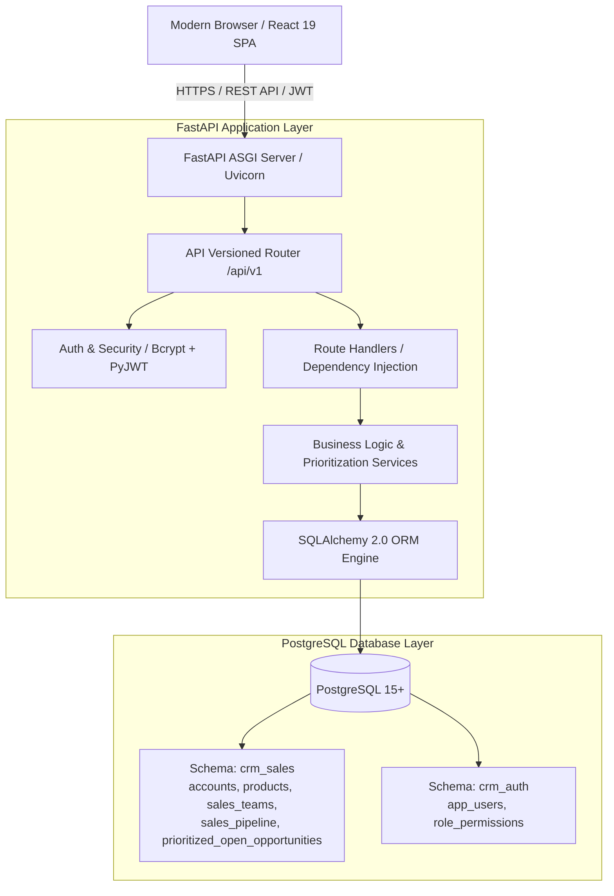

# Vantage

<p align="center">
  
</p>

<p align="center">
  <strong>Enterprise Revenue Operations & Sales Orchestration Platform</strong>
  <br />
  A high-throughput, audited full-stack revenue platform engineered for high-velocity B2B sales organizations.
</p>

<p align="center">
  
  
  
  
  
  
  
  
</p>

---

## Executive Overview

**Vantage CRM** is an enterprise-grade Sales Operations and Pipeline Management Platform designed to streamline B2B revenue workflows, sequence high-priority deals, and provide real-time sales visibility. Engineered with clean layered architecture, the platform combines a robust **FastAPI** backend with a modern **React 19** single-page application (SPA) featuring design tokens translated from Google Stitch design specifications.

The platform processes and analyzes **8,800 opportunities** across **85 enterprise accounts**, **7 product lines**, and **35 sales personnel** across regional offices, enforcing strict business reconciliation, deterministic lead prioritization, and enterprise security.

---

## Key Highlights

- **Executive Revenue Engine:** Real-time reconciliation of **$10,005,534.00 Won Revenue**, **63.15% Win Rate**, **4,238 Won Deals**, and **47.99-day Average Sales Cycle**.
- **Deterministic Deal Prioritization:** Transparent 100-point scoring algorithm segmenting active pipeline into **Tier 1 (428)**, **Tier 2 (1,033)**, and **Tier 3 (628)** opportunities without statistical post-outcome leakage.
- **Actionable Work Queues:** Targeted operational queues for executive review, stalled deal intervention (>180 days), and unassigned lead hygiene.
- **Hierarchical Sales Org Modeling:** Granular analytics covering 30 active sales representatives, 6 regional sales managers, and 3 regional offices (Central, East, West).
- **Modern Responsive SPA:** Asymmetric bento grids, sticky tabbed inspector drawers, tabular figures (`.tnum`), and live multi-filter query builders built on Tailwind CSS and Inter typography.
- **Enterprise Security:** Stateless JWT authentication, Bcrypt password hashing, and Role-Based Access Control (RBAC) across `Admin`, `Sales Manager`, and `Sales Agent` roles.

---

## User Interface & Design System

The Vantage CRM user interface is built on modern enterprise design principles, featuring low-fatigue dark palettes, high-density data tables, and interactive contextual drawers.

<table width="100%">
  <tr>
    <td width="50%">
      <h3 align="center">Opportunities Directory</h3>
      
      <p align="center"><em>Searchable, sortable directory with multi-stage filtering and quick filters.</em></p>
    </td>
    <td width="50%">
      <h3 align="center">Opportunity Detail Drawer</h3>
      
      <p align="center"><em>Non-destructive flyout drawer with lifecycle timelines and account context.</em></p>
    </td>
  </tr>
  <tr>
    <td width="50%">
      <h3 align="center">Opportunity Priority Matrix</h3>
      
      <p align="center"><em>Tier 1, Tier 2, and Tier 3 segmentation with 100-pt scoring breakdown.</em></p>
    </td>
    <td width="50%">
      <h3 align="center">Operational Work Queues</h3>
      
      <p align="center"><em>Targeted queues for executive reviews, stalled deals (>180d), and unassigned accounts.</em></p>
    </td>
  </tr>
</table>

---

## System Architecture

The application adopts a decoupled, multi-tier architecture ensuring high maintainability, strict separation of concerns, and optimal query throughput:



### Directory Structure

```
CRM/
├── backend/
│   └── app/
│       ├── api/                      # Route definitions & dependency injection
│       │   ├── deps.py               # Database session & JWT authentication dependencies
│       │   └── v1/                   # Versioned REST endpoints (10 resource controllers)
│       ├── core/                     # Application configuration, database engine, security
│       ├── models/                   # SQLAlchemy 2.0 declarative database models
│       ├── schemas/                  # Pydantic v2 validation & response contracts
│       ├── services/                 # Pure domain business logic & aggregation services
│       └── main.py                   # FastAPI entrypoint, middleware, exception handlers
├── frontend/
│   ├── src/
│   │   ├── api/                      # Axios client with automatic JWT bearer interception
│   │   ├── components/               # Reusable UI primitives (AppShell, Tables, Drawers, Cards)
│   │   ├── context/                  # React Context providers (AuthContext, NotificationContext)
│   │   ├── pages/                    # 13 Application views (Overview, Opportunities, Priorities, etc.)
│   │   ├── App.jsx                   # Application routing and protected route guards
│   │   └── index.css                 # Global design tokens, typography, and utility classes
│   ├── package.json                  # Frontend dependencies and build scripts
│   └── vite.config.js                # Vite build and dev-server configuration
├── config/                           # Global environment settings
├── data/
│   ├── raw/                          # Immutable source CSV datasets
│   └── processed/                    # Cleaned, standardized CRM CSV tables
├── docs/                             # Engineering specifications, schemas & screenshots
├── sql/
│   ├── ddl/                          # Database DDL schemas (crm_sales, crm_auth)
│   └── analytics/                    # Production SQL analytical queries
├── src/                              # Data transformation, ETL & prioritization scripts
│   ├── data_cleaning/clean_sales.py  # Production data cleaning pipeline
│   ├── database/load_postgres.py     # PostgreSQL schema loader & index creator
│   └── prioritization/crm_priority.py# Deterministic priority scoring algorithm
└── tests/                            # Comprehensive Pytest automated test suites
```

---

## Technology Stack

| Layer | Technologies | Description |
|---|---|---|
| **Frontend Framework** | React 19, Vite 6 | High-speed component rendering and hot-module reloading |
| **Styling & Icons** | Tailwind CSS 3.4, Material Symbols | Custom design token system translated from Google Stitch specs |
| **API Client & Routing** | Axios, React Router 7 | JWT bearer interceptor, declarative routing, protected routes |
| **Backend Framework** | FastAPI 0.110+, Uvicorn 0.28+ | High-throughput asynchronous REST API engine |
| **Database & ORM** | PostgreSQL 15+, SQLAlchemy 2.0 | Multi-schema relational storage with indexed query execution |
| **Validation & Schemas** | Pydantic v2, Pydantic-Settings | Strict request/response contracts and configuration parsing |
| **Security & Auth** | PyJWT (HS256), Bcrypt | Stateless cryptographic token signing and password hashing |
| **Data Processing** | Pandas 2.2+, NumPy 1.26+ | ETL pipelines, metric computation, and priority calculations |
| **Quality Assurance** | Pytest 8.0+, HTTPX TestClient, Oxlint | End-to-end API integration and business reconciliation tests |

---

## Core Business Logic & Mathematical Definitions

The platform enforces standardized mathematical formulas to eliminate reporting discrepancies across sales leadership:

### 1. Opportunity Lifecycle Categorization
$$\text{Total Opportunities (8,800)} = \text{Open Pipeline (2,089)} + \text{Closed Pipeline (6,711)}$$
- **Open Pipeline:** Opportunities in `Prospecting` (500) or `Engaging` (1,589) status.
- **Closed Pipeline:** Opportunities in `Won` (4,238) or `Lost` (2,473) status.

### 2. Win Rate Calculation
Standard B2B sales operations convention evaluates win rate exclusively against closed decisions:
$$\text{Win Rate} = \frac{\text{Won}}{\text{Won} + \text{Lost}} \times 100\% = \frac{4,238}{4,238 + 2,473} \times 100\% = 63.15\%$$

### 3. Won Revenue & Average Deal Size
$$\text{Won Revenue} = \sum_{i=1}^{4,238} \text{close\_value}_i = \$10,005,534.00$$
$$\text{Average Deal Size} = \frac{\text{Won Revenue}}{\text{Won Count}} = \frac{\$10,005,534.00}{4,238} = \$2,360.91$$

### 4. Sales Cycle Duration
$$\text{Sales Cycle (Days)} = \text{close\_date} - \text{engage\_date}$$
$$\text{Average Sales Cycle} = \text{mean}(\text{Sales Cycle for all Closed Deals with valid dates}) = 47.99 \text{ days}$$

---

## Deterministic Opportunity Prioritization Framework

Rather than relying on uninterpretable predictive algorithms that risk data leakage, Vantage CRM applies an **audited, deterministic 100-point scoring framework** to rank all **2,089 active open opportunities**.

> **Note on Model Governance:** This model strictly utilizes operational pre-close parameters. Post-outcome variables (`close_date`, `close_value`) are quarantined to ensure zero future data leakage.

### Scoring Dimensions (100 Points Total)

```
┌────────────────────────────────────────────────────────────────────────┐
│                      CRM PRIORITY SCORE (0-100 PTS)                    │
├──────────────────┬──────────────────┬──────────────────┬───────────────┤
│ Lifecycle Stage  │ Product Catalog  │ Account Scale    │ Deal Age &    │
│ (Max 30 pts)     │ Value Tier       │ Tier             │ Urgency       │
│                  │ (Max 30 pts)     │ (Max 25 pts)     │ (Max 15 pts)  │
├──────────────────┼──────────────────┼──────────────────┼───────────────┤
│ Engaging: 30 pts │ High Value: 30pt │ Enterprise: 25pt │ Recent: 15 pt │
│ Prospecting: 10  │ Med Value:  20pt │ Mid-Market: 15pt │ Aging:  10 pt │
│                  │ Low Value:  10pt │ Commercial: 10pt │ Stalled: 5 pt │
│                  │                  │ Unassigned:  5pt │ Unengaged: 5  │
└──────────────────┴──────────────────┴──────────────────┴───────────────┘
```

1. **Lifecycle Stage (Max 30 pts):**
   - `Engaging`: **30 pts** (Active dialogue established)
   - `Prospecting`: **10 pts** (Early discovery)
2. **Product Catalog Value Tier (Max 30 pts):**
   - `High Value` (List Price $\ge \$4,000$): **30 pts** (`GTK 500`, `GTX Plus Pro`, `GTX Pro`)
   - `Medium Value` (List Price $\$1,000 - \$3,999$): **20 pts** (`MG Advanced`, `GTX Plus Basic`)
   - `Low Value` (List Price $< \$1,000$): **10 pts** (`GTX Basic`, `MG Special`)
3. **Strategic Account Scale Tier (Max 25 pts):**
   - `Enterprise` (Revenue $\ge \$2,500\text{M}$ OR Employees $\ge 5,000$): **25 pts**
   - `Mid-Market` (Revenue $\$500\text{M}-\$2,500\text{M}$ OR Employees $1,000-5,000$): **15 pts**
   - `Commercial / Small` (Revenue $< \$500\text{M}$ AND Employees $< 1,000$): **10 pts**
   - `Unassigned Account`: **5 pts**
4. **Engagement Age & Urgency (Max 15 pts):**
   - `Recent (<= 90 days)`: **15 pts** (High momentum)
   - `Aging (91 - 180 days)`: **10 pts** (Attention needed)
   - `Stalled / Critical (> 180 days)`: **5 pts** (Intervention required)
   - `Unengaged (Prospecting)`: **5 pts** (Baseline)

### Priority Tiers & Action Strategy

| Priority Tier | Score Threshold | Opportunity Volume | Strategic Operations Action |
|---|---|:---:|---|
| **Tier 1 — High Priority** | $\ge 75 \text{ points}$ | **428** | Immediate executive sponsor engagement; top quota-carriers assigned. |
| **Tier 2 — Medium Priority** | $55 - 74 \text{ points}$ | **1,033** | Standard structured sales cadence; bi-weekly pipeline review. |
| **Tier 3 — Lower Priority** | $< 55 \text{ points}$ | **628** | Automated lead nurturing, self-service materials, qualification check. |
| **Total Open Pipeline** | | **2,089** | Complete active pipeline coverage. |

---

## Database Schema & Data Integrity

The relational layer is organized into two isolated PostgreSQL schemas:

```
                  ┌───────────────────────────────┐
                  │      crm_sales.accounts       │
                  │ (85 rows, self-ref parent_id) │
                  └───────────────┬───────────────┘
                                  │ 1:N
┌───────────────────────────┐     │     ┌───────────────────────────┐
│     crm_sales.products    │     │     │   crm_sales.sales_teams   │
│   (7 rows, series, price) │     │     │ (35 reps, managers, reg)  │
└─────────────┬─────────────┘     │     └─────────────┬─────────────┘
              │ 1:N               │                   │ 1:N
              └─────────────┐     │     ┌─────────────┘
                            ▼     ▼     ▼
                  ┌───────────────────────────────┐
                  │   crm_sales.sales_pipeline    │
                  │         (8,800 rows)          │
                  └───────────────┬───────────────┘
                                  │ 1:1
                                  ▼
                  ┌───────────────────────────────┐
                  │ prioritized_open_opportunities│
                  │   (2,089 open opportunities)  │
                  └───────────────────────────────┘
```

### Data Integrity Standards
1. **Zero Synthetic Records:** All accounts, transactions, and agents represent real B2B CRM structures. No simulated customer records or fabricated activity events are introduced.
2. **Preservation of Authentic Nulls:**
   - In-flight prospecting deals legitimately contain `NULL` engage dates prior to first customer touch.
   - 1,425 early-stage opportunities legitimately possess `NULL` account IDs prior to corporate entity assignment.
   - Open deals have `NULL` close dates and values, preventing look-ahead bias.
3. **Data Quality Corrections:** Documented standardizations (e.g., `GTXPro` $\rightarrow$ `GTX Pro`, `technolgy` $\rightarrow$ `technology`, `Philipines` $\rightarrow$ `Philippines`) are applied deterministically in ETL scripts.

---

## REST API Reference

All endpoints are versioned under `/api/v1`. Comprehensive interactive documentation is accessible via Swagger UI at `http://127.0.0.1:8000/docs` or ReDoc at `http://127.0.0.1:8000/redoc`.

### Authentication & User Profile
- `POST /api/v1/auth/login` — Authenticate user and receive JWT access token.
- `GET /api/v1/auth/me` — Retrieve profile and permissions of authenticated user.

### Pipeline Analytics & Reconciliation
- `GET /api/v1/pipeline/summary` — Executive overview KPIs (total volume, won revenue, win rate, average cycle).
- `GET /api/v1/pipeline/stages` — Opportunity counts and volume grouped by pipeline stage.
- `GET /api/v1/pipeline/products` — Win rate, revenue, and opportunity distribution by product.
- `GET /api/v1/pipeline/sectors` — Performance analytics sliced by industry vertical.
- `GET /api/v1/pipeline/agents` — Performance rankings across 30 active sales representatives.
- `GET /api/v1/pipeline/managers` — Aggregate team volume and win rate sliced by sales manager.
- `GET /api/v1/pipeline/regions` — Regional office performance (Central, East, West).

### Opportunity Management & Prioritization
- `GET /api/v1/opportunities` — Paginated, searchable, multi-filtered opportunity ledger.
- `GET /api/v1/opportunities/{id}` — Full opportunity details with historical duration and account context.
- `GET /api/v1/prioritization` — Deterministic opportunity ranking filtered by score and tier.
- `GET /api/v1/prioritization/summary` — Distribution metrics across Tier 1, Tier 2, and Tier 3.
- `GET /api/v1/aging/summary` — Pipeline aging distributions across operational bands.

### Work Queues & Operations
- `GET /api/v1/work-queues/summary` — Aggregate summary counts across all operational queues.
- `GET /api/v1/work-queues/high-priority` — Action queue containing all Tier 1 high-priority opportunities.
- `GET /api/v1/work-queues/stalled-deals` — Intervention queue for active deals exceeding 180 days.
- `GET /api/v1/work-queues/unassigned-accounts` — Data hygiene queue for deals missing account linkages.

### Accounts & Catalog
- `GET /api/v1/accounts` — Filtered, searchable directory of enterprise accounts.
- `GET /api/v1/accounts/{id}` — Detailed account profile including subsidiaries and historical win/loss stats.
- `GET /api/v1/products` — Catalog of products with pricing tiers and total revenue generated.
- `GET /api/v1/agents/{name}` — Individual representative scorecard and stage breakdown.
- `GET /api/v1/managers/{name}` — Manager scorecard with subordinate representative benchmarks.

---

## Quickstart & Local Setup

Follow these steps to run the complete Vantage CRM platform locally.

### Prerequisites
- **Python 3.11+**
- **Node.js 18+** & **npm 9+**
- **PostgreSQL 14+** running locally or via Docker

---

### Step 1: Clone Repository & Configure Environment

```bash
git clone https://github.com/kumarvishal10351/Vantage-CRM.git
cd Vantage-CRM

# Copy environment configuration
cp .env.example .env
```

Edit `.env` with your PostgreSQL connection parameters:
```ini
DB_HOST=localhost
DB_PORT=5432
DB_NAME=crm_platform
DB_USER=postgres
DB_PASSWORD=your_postgres_password
JWT_SECRET_KEY=crm-super-secret-production-key-change-in-env-2026
```

---

### Step 2: Backend Installation & Database Setup

```bash
# Create and activate virtual environment
python -m venv venv
# On Windows:
.\venv\Scripts\activate
# On macOS/Linux:
source venv/bin/activate

# Install dependencies
pip install -r requirements.txt

# Run ETL Pipeline and Load Database
python src/data_cleaning/clean_sales.py
python src/prioritization/crm_priority.py
python src/database/load_postgres.py
```

---

### Step 3: Launch the Backend API Server

```bash
uvicorn backend.app.main:app --host 127.0.0.1 --port 8000 --reload
```
The REST API is now live at `http://127.0.0.1:8000`.  
Swagger documentation is available at `http://127.0.0.1:8000/docs`.

---

### Step 4: Launch the Frontend Web Application

In a separate terminal:
```bash
cd frontend
npm install
npm run dev
```
The Vantage CRM UI is now live at `http://127.0.0.1:5173`.

---

### Default Credentials

The database loader provisions default administrator credentials for immediate access:

| Role | Email | Password |
|---|---|---|
| **System Admin** | `admin@crm.local` | `AdminPass123!` |
| **Sales Manager** | `manager@crm.local` | `ManagerPass123!` |
| **Sales Agent** | `agent@crm.local` | `AgentPass123!` |

---

## Quality Assurance & Automated Testing

The platform maintains a comprehensive automated testing suite built with **Pytest** and **HTTPX**. Tests validate route contracts, authentication flows, error handling, and mathematical business reconciliation.

```bash
# Execute complete automated test suite
pytest

# Execute with verbose output
pytest -v

# Run business logic & reconciliation tests exclusively
pytest tests/test_business_reconciliation.py -v
```

### Verified System Invariants
- **Total Opportunities:** 8,800
- **Won Opportunities:** 4,238
- **Lost Opportunities:** 2,473
- **Prospecting Opportunities:** 500
- **Engaging Opportunities:** 1,589
- **Total Open Opportunities:** 2,089
- **Total Closed Opportunities:** 6,711
- **Reconciled Win Rate:** 63.15%
- **Reconciled Won Revenue:** $10,005,534.00
- **Average Deal Size:** $2,360.91
- **Average Sales Cycle Duration:** 47.99 days
- **Prioritization Tier Distribution:** Tier 1 (428) | Tier 2 (1,033) | Tier 3 (628)
- **Suite Result:** `65 passed in 9.37s` (100% pass rate)

---

## Security & Compliance

- **Stateless Authentication:** Signed JWT bearer tokens with configurable expiration (`ACCESS_TOKEN_EXPIRE_MINUTES`).
- **Cryptographic Hashing:** Passwords hashed using Bcrypt with auto-generated salts.
- **SQL Injection Prevention:** 100% parameterized queries via SQLAlchemy 2.0 ORM expressions.
- **CORS Protection:** Configurable cross-origin resource sharing middleware restricting origins to authorized frontends.
- **Input Sanitization:** Strict Pydantic v2 schemas validating request data types, ranges, and patterns.

---

## License

This project is licensed under the MIT License. See the [LICENSE](LICENSE) file for complete details.
