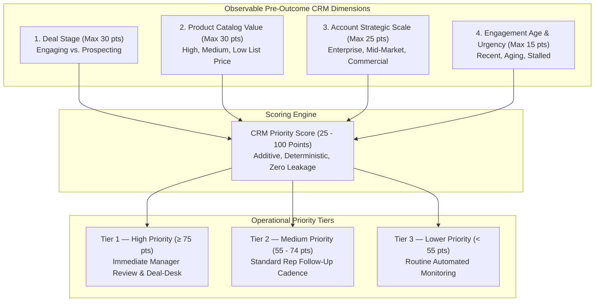

# Interpretable CRM Opportunity Prioritization Framework

**Module:** Sales CRM Operations & Pipeline Prioritization  
**Phase:** 5 — Interpretable CRM Opportunity Prioritization Framework  
**Database:** `crm_platform` (Schema: `crm_sales`)  
**Target Audience:** Sales Leadership, Sales Operations, Account Executives  
**Dataset Reference Snapshot:** `2017-12-31`  
**Output Artifact:** `data/processed/crm_sales/prioritized_open_opportunities.csv`  

---

## 1. Business Objective & Governance Declarations

In enterprise B2B sales operations, sales leadership and account executives require an objective, transparent, and reproducible method to allocate time, executive sponsorship, and solution architecture resources across the active sales pipeline.

The business question answered by this framework is:
> **"Which active open opportunities should sales teams review or prioritize first based on observable, verified CRM information?"**

### Critical Governance Statements:
- **"The CRM Priority Score is an operational prioritization index. It is not a probability of winning, forecast, expected revenue, or predictive model."**
- **Operational Business Rules:** The scoring weights and thresholds are **OPERATIONAL BUSINESS RULES**, not statistically optimized predictive weights.
- **Resource Allocation vs. Likelihood:** **"Tier 1 opportunities receive higher operational attention based on the selected business-priority rules."** They are NOT more likely to win.
- **Observable Factor Scope:** **"The framework prioritizes observable opportunity-management factors but does not estimate probability of conversion."**

---

## 2. Why Machine Learning Win/Loss Prediction Was Rejected

In Phase 4B and Phase 4C, supervised machine learning algorithms (Logistic Regression, Decision Trees, Random Forests) were benchmarked across 6,711 historical closed opportunities. The exhaustive empirical diagnostic established:

1. **Absence of Predictive Signal in Static Pre-Outcome Attributes:**
   - Pre-outcome firmographics (`sector`, `revenue`, `employees`, `office_location`), product catalog prices, and sales hierarchies have near-zero correlation with win/loss outcomes ($|r| \le 0.012$, all $p > 0.30$).
   - 100% of 95% Wilson confidence intervals across all categorical dimensions overlap the 63.15% base rate.
2. **Low Model Discrimination:**
   - 5-fold cross-validated ROC-AUC flatlined between **0.498 and 0.542** (functionally indistinguishable from random guessing).
   - Learning curves proved asymptotic at $N=5,368$; additional sample volume cannot compensate for the lack of dynamic behavioral signals.
3. **Operational Risks of False Precision:**
   - Presenting uncalibrated, near-random "probabilities" to sales teams creates false confidence on bad deals and premature abandonment of salvageable accounts.

**Decision:** Reject black-box predictive models and deploy a **transparent, deterministic, rule-based CRM prioritization framework** grounded in operational resource management.

---

## 3. Four Core Prioritization Dimensions

The framework computes a composite priority score from four observable pre-outcome CRM dimensions:



---

## 4. Analytical Tier Definitions & Operational Rule Justifications

> **Non-Causal Attribute Clarification:**
> - Product price represents **catalog value**; it is **NOT** estimated deal value.
> - Account tier represents **analytical strategic scale**; it is **NOT** account quality.
> - Engagement age represents **operational aging/urgency**; it is **NOT** stage velocity.
> - **None of these attributes imply causal effects on winning.**

### Dimension 1: Deal Lifecycle Stage (Max 30 Points)
*Note: Tier 1 is intentionally dominated by Engaging opportunities because stage carries the largest fixed score component.*

| Category | Definition / Rule | Points | Operational Business Rule Rationale |
|:---|:---|:---:|:---|
| **Engaging** | Deal has an assigned rep, initial client contact, and verified interest ($N = 1,589$). | **30** | Active engagements represent near-term sales capacity and require immediate rep responsiveness. |
| **Prospecting** | Unqualified top-of-funnel lead; unassigned account ($N = 500$). | **10** | Early-stage lead; requires basic qualification before dedicating managerial review. |

---

### Dimension 2: Product Catalog Value Tier (Max 30 Points)
*Catalog list price (`sales_price`) represents published catalog value, NOT an estimated open-deal value.*

| Product Tier | Catalog List Price Range | Included Products | Points | Operational Business Rule Rationale |
|:---|:---:|:---|:---:|:---|
| **High Value** | $\ge \$4,000$ | `GTK 500` (\$26,768), `GTX Plus Pro` (\$5,482), `GTX Pro` (\$4,821) | **30** | High-ticket product configurations drive top-line catalog value and warrant solution engineering support. |
| **Medium Value** | $\$1,000 - \$3,999$ | `MG Advanced` (\$3,393), `GTX Plus Basic` (\$1,096) | **20** | Mid-tier core products representing standard enterprise software packages. |
| **Low Value** | $< \$1,000$ | `GTX Basic` (\$550), `MG Special` (\$55) | **10** | Low-price add-ons and entry hardware; low catalog revenue impact per transaction. |

---

### Dimension 3: Account Strategic Scale Tier (Max 25 Points)
*Represents analytical strategic scale derived from revenue and employee quartiles across the 85 unique enterprise accounts.*

| Account Tier | Revenue & Headcount Thresholds | Points | Operational Business Rule Rationale |
|:---|:---|:---:|:---|
| **Enterprise** | Revenue $\ge \$2,500\text{M}$ **OR** Employees $\ge 5,000$ (Top quartile scale) | **25** | Large corporations have complex buying committees and require executive sponsor alignment. |
| **Mid-Market** | Revenue $\$500\text{M} - \$2,500\text{M}$ **OR** Employees $1,000 - 5,000$ | **15** | Established mid-tier firms with defined IT budgets and standard procurement processes. |
| **Commercial / Small** | Revenue $< \$500\text{M}$ **AND** Employees $< 1,000$ | **10** | Smaller companies with direct decision-makers and simpler approval chains. |
| **Unassigned Account** | Account field is NULL (e.g. early qualification stage) | **5** | Unverified account scale; receives baseline qualification weight. |

---

### Dimension 4: Engagement Age & Urgency (Max 15 Points)
*Operational aging calculated as: $\text{engagement\_age\_days} = \text{2017-12-31} - \text{engage\_date}$. (Prospecting = 0 days).*

| Age Band | Active Duration in Pipeline | Points | Operational Business Rule Rationale |
|:---|:---:|:---:|:---|
| **Recent Momentum** | $\le 90$ days | **15** | Fresh deals possess high operational momentum; immediate follow-up accelerates progression. |
| **Aging Follow-up** | $91 - 180$ days | **10** | Exceeds average sales cycle (48 days); requires manager check-in to unblock bottlenecks. |
| **Stalled / Critical** | $> 180$ days | **5** | In pipeline over 6 months; operational aging risk. Requires deal-desk re-qualification or close-out. |
| **Unengaged (Prospecting)** | 0 days (Not yet engaged) | **5** | Early top-of-funnel lead. |

---

## 5. Composite Priority Score & Priority Tiers

### Score Formulation:
$$\text{CRM Priority Score} = \text{Stage Points } (10\text{--}30) + \text{Product Points } (10\text{--}30) + \text{Account Points } (5\text{--}25) + \text{Age Points } (5\text{--}15)$$

- **Total Score Range:** **25 to 100 Points** (Deterministic, integer scale).

### Actionable Priority Tiers:
| Priority Tier | Score Threshold | Operational Workflow & Action Plan |
|:---|:---:|:---|
| **Tier 1 — High Priority** | **$\ge 75$ Points** | **Immediate Manager Review:** Tier 1 opportunities receive higher operational attention based on the selected business-priority rules (weekly 1-on-1, solution architect assignment). |
| **Tier 2 — Medium Priority** | **$55 - 74$ Points** | **Standard Rep Cadence:** Bi-weekly rep follow-up, send standard pricing proposals, track next steps in CRM. |
| **Tier 3 — Lower Priority** | **$< 55$ Points** | **Routine Monitoring:** Automated lead nurturing, SDR qualification, close-out aged non-responsive leads. |

---

## 6. Retrospective Diagnostic on Historical Closed Deals ($N = 6,711$)

To evaluate how historical closed opportunities map into these operational tiers, the scoring rules were applied retrospectively to the 6,711 closed deals.

> **Methodological Clarification:**
> The retrospective closed-deal analysis is a **diagnostic check only and was NOT used to optimize the scoring weights**.

| Priority Tier | Closed Deals Evaluated | Won Deals | Lost Deals | Retrospective Win Rate (%) |
|:---|---:|---:|---:|---:|
| **Tier 1 — High Priority** | 871 | 552 | 319 | **63.38%** |
| **Tier 2 — Medium Priority** | 4,197 | 2,627 | 1,570 | **62.59%** |
| **Tier 3 — Lower Priority** | 1,643 | 1,059 | 584 | **64.46%** |
| **Total Closed Population** | **6,711** | **4,238** | **2,473** | **63.15%** |

### Retrospective Diagnostic Finding:
> **"Retrospective results show that the priority tiers do not meaningfully separate historical Won/Lost outcomes. Leakage prevention was established separately through feature restrictions and automated validation."**

---

## 7. Current Open Pipeline Prioritization Results ($N = 2,089$)

The framework was applied to all 2,089 active open opportunities:

### Overall Priority Tier Distribution

```text
Open Pipeline Prioritization Distribution (N=2,089):
Tier 1 — High Priority:   [========] 20.49% (428 Deals)
Tier 2 — Medium Priority: [====================] 49.45% (1,033 Deals)
Tier 3 — Lower Priority:  [============] 30.06% (628 Deals)
```

| Priority Tier | Open Deal Count | % of Open Pipeline | Engaging Deals | Prospecting Deals |
|:---|---:|---:|---:|---:|
| **Tier 1 — High Priority** | **428** | **20.49%** | 428 | 0 |
| **Tier 2 — Medium Priority** | **1,033** | **49.45%** | 972 | 61 |
| **Tier 3 — Lower Priority** | **628** | **30.06%** | 189 | 439 |
| **Total Open Pipeline** | **2,089** | **100.00%** | **1,589** | **500** |

*Note on Distribution:* Tier 1 consists exclusively of Engaging deals (428) because lifecycle stage carries the largest fixed point allocation (30 pts), ensuring management focuses immediately on active customer conversations.

---

## 8. Sales Management Cross-Dimensional Breakdowns

### A. Priority Tier by Account Strategic Scale
| Account Tier | Tier 1 (High) | Tier 2 (Medium) | Tier 3 (Lower) | Total Open Deals |
|:---|---:|---:|---:|---:|
| **Enterprise** | **152** | 58 | 20 | **230** |
| **Mid-Market** | **82** | 140 | 59 | **281** |
| **Commercial / Small** | **37** | 93 | 23 | **153** |
| **Unassigned Account** | **157** | 742 | 526 | **1,425** |
| **Total** | **428** | **1,033** | **628** | **2,089** |

---

### B. Priority Tier by Product Catalog Value
| Product Value Tier | Tier 1 (High) | Tier 2 (Medium) | Tier 3 (Lower) | Total Open Deals |
|:---|---:|---:|---:|---:|
| **High Value ($\ge \$4\text{k}$)** | **296** | 196 | 79 | **571** |
| **Medium Value (\$1k–\$4k)** | **95** | 418 | 147 | **660** |
| **Low Value ($<\$1\text{k}$)** | **37** | 419 | 402 | **858** |
| **Total** | **428** | **1,033** | **628** | **2,089** |

---

### C. Top 10 Sales Representatives by Tier 1 Workload
| Sales Representative | Tier 1 (High) Deals | Tier 2 (Medium) Deals | Tier 3 (Lower) Deals | Total Open Pipeline |
|:---|---:|---:|---:|---:|
| **Darcel Schlecht** | **52** | 79 | 36 | **167** |
| **Cassey Cress** | **29** | 43 | 26 | **98** |
| **Kary Hendrixson** | **27** | 44 | 22 | **93** |
| **Daniell Hammack** | **23** | 30 | 17 | **70** |
| **Zane Levy** | **23** | 39 | 24 | **86** |
| **Vicki Laflamme** | **23** | 63 | 36 | **122** |
| **Kami Bicknell** | **22** | 36 | 28 | **86** |
| **James Ascencio** | **21** | 36 | 20 | **77** |
| **Anna Snelling** | **19** | 56 | 32 | **107** |
| **Corliss Cosme** | **18** | 38 | 21 | **77** |

---

## 9. Limitations & Explicit Governance Guardrails

1. **Conversion Probability Limitation:**
   > **"The framework prioritizes observable opportunity-management factors but does not estimate probability of conversion."**
2. **Catalog Price vs. Deal Value:** Product `sales_price` represents catalog list price. It is **NOT** an estimated open deal value, and open deals must not have synthetic expected revenue calculated from it.
3. **Absence of Real-Time Interaction Logs:** The framework evaluates static CRM metadata. It cannot observe meeting cadence, customer sentiment, or competitor discounting.
4. **Operational Focus:** Tier 3 opportunities receive lower operational review priority, but should not be automatically disqualified without sales qualification.

---

## 10. Operational Guidelines for Sales Teams

```text
┌─────────────────────────────────────────────────────────────────────────────────────────────┐
│                             CRM SALES WORKFLOW PLAYBOOK                                    │
├─────────────────────────────────────────────────────────────────────────────────────────────┤
│ TIER 1 (High Operational Attention — Score 75-100):                                         │
│ • Tier 1 opportunities receive higher operational attention based on business-priority rules.│
│ • Weekly 1-on-1 review between Account Executive and Sales Manager.                        │
│ • Dedicate Solutions Engineering / Solution Architecture resources for technical validation.│
│ • Verify executive sponsor alignment at target Enterprise / Mid-Market account.             │
├─────────────────────────────────────────────────────────────────────────────────────────────┤
│ TIER 2 (Medium Operational Attention — Score 55-74):                                        │
│ • Standard representative follow-up cadence (bi-weekly customer touchpoints).               │
│ • Deliver standard product collateral and pricing proposals.                                │
│ • Complete account discovery and link unassigned corporate accounts in CRM.                 │
├─────────────────────────────────────────────────────────────────────────────────────────────┤
│ TIER 3 (Lower Operational Attention — Score 25-54):                                         │
│ • Route Prospecting leads to Sales Development Reps (SDRs) for basic qualification.        │
│ • Deploy automated marketing email nurturing tracks for low-touch products.                │
│ • Re-qualify or cleanly close out stalled deals active for > 180 days.                     │
└─────────────────────────────────────────────────────────────────────────────────────────────┘
```
